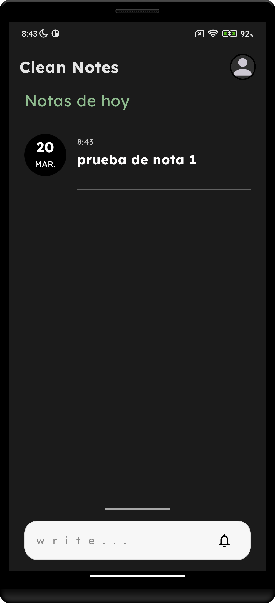
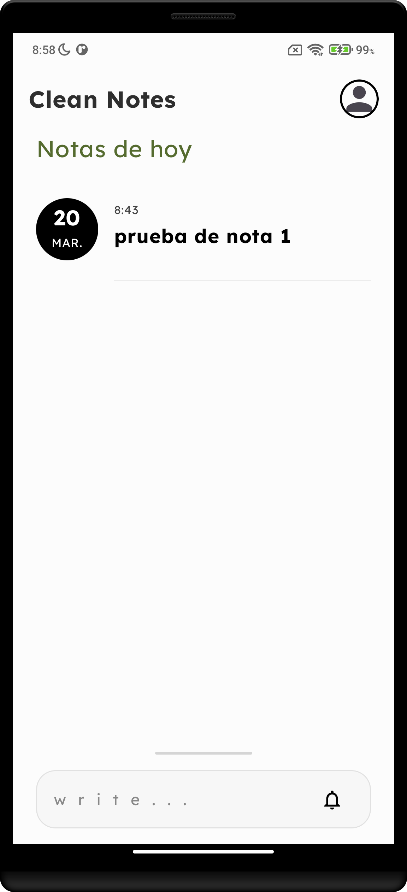

# CleanNotes

CleanNotes is a modern Android application for creating and managing notes. It is built to demonstrate the use of Clean Architecture along with modern Android development practices and Jetpack libraries.

## 🛠 Tech Stack & Architecture

* **Language:** [Kotlin](https://kotlinlang.org/)
* **UI Toolkit:** [Jetpack Compose](https://developer.android.com/jetpack/compose) - Declarative UI framework
* **Architecture:** Clean Architecture (Presentation, Domain, and Data layers) & MVVM
* **Dependency Injection:** [Dagger Hilt](https://dagger.dev/hilt/)
* **Local Database:** [Room](https://developer.android.com/training/data-storage/room)
* **Asynchronous Programming:** Kotlin Coroutines & Flow
* **Navigation:** Jetpack Compose Navigation

## ✨ Features

* Create, view, edit, and manage your notes.
* Clean, minimalist, and intuitive User Interface.
* Offline support with local data persistence using Room.
* Built following modern Android development best practices.

## Image examples

### Home Screen
      


## 🚀 Getting Started

To run the project locally, clone the repository and open it in **Android Studio**.

```bash
git clone https://github.com/your-username/CleanNotes.git
```

1. Open Android Studio.
2. Select `File` -> `Open...` and choose the cloned `CleanNotes` directory.
3. Wait for Gradle to finish syncing the project.
4. Run the application on an Android Emulator or a physical device.

## 🤝 Contributing

Contributions are always welcome! If you have any ideas, suggestions, or bug reports, feel free to open an issue or submit a pull request.

## 📝 License

This project is licensed under the MIT License.
